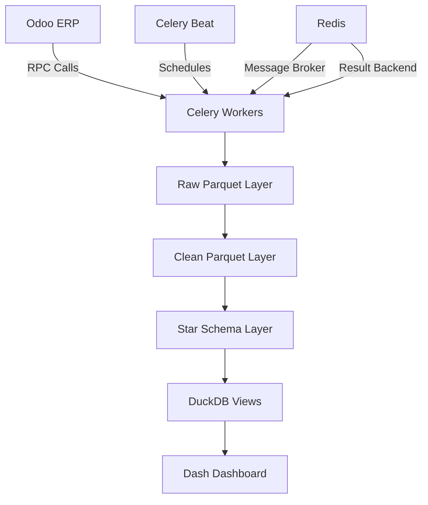
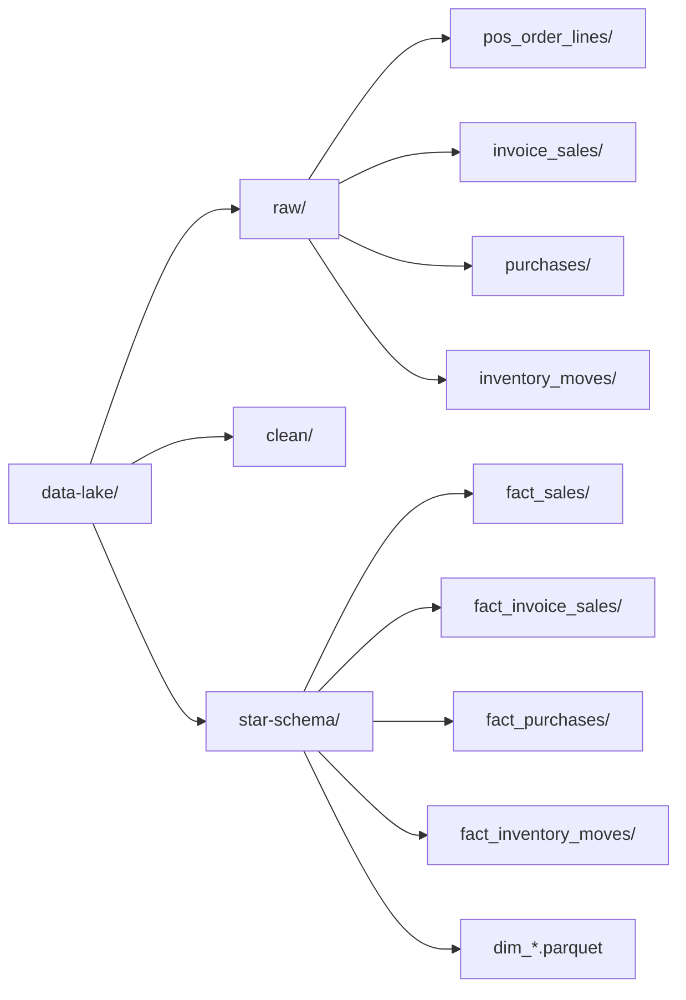
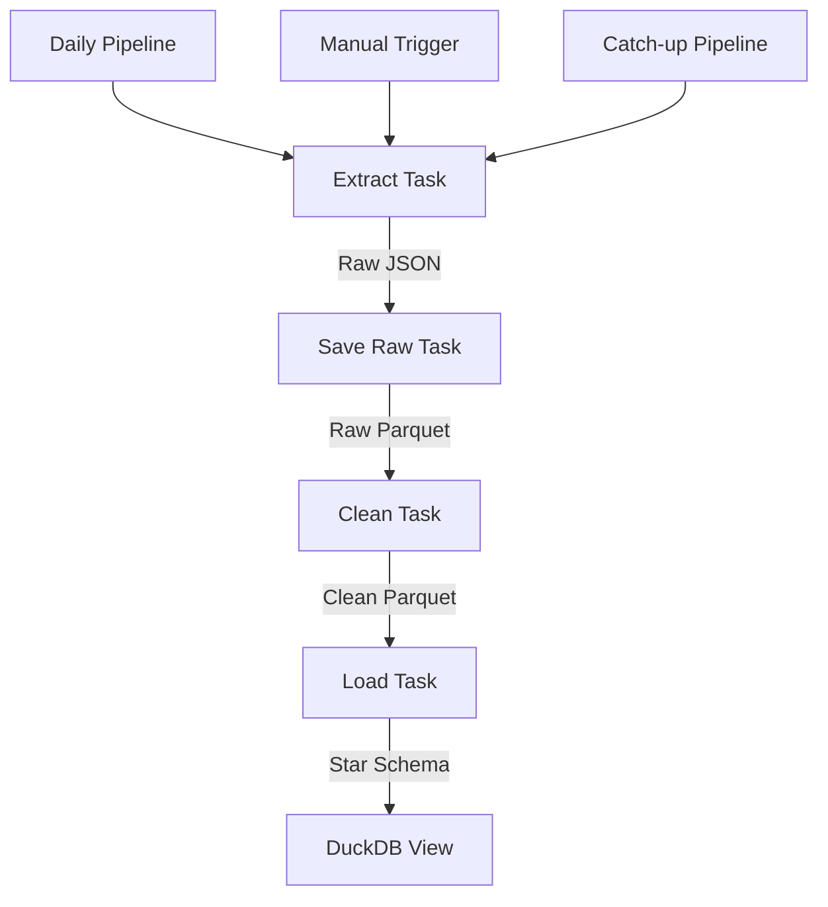
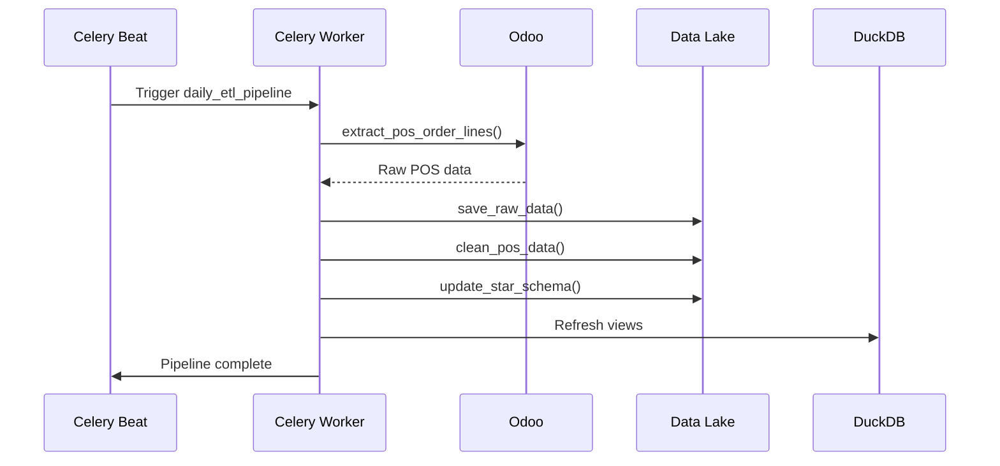

# NKDash ETL Technical Guide

This document provides comprehensive technical documentation for the ETL pipeline, including architecture, task definitions, and development guidelines.

## Table of Contents
- [Overview](#overview)
- [Architecture](#architecture)
- [Task Catalog](#task-catalog)
- [Data Flow](#data-flow)
- [Development Guide](#development-guide)
- [Configuration](#configuration)
- [Performance](#performance)

---

## Overview

### ETL Pipeline Purpose
The NKDash ETL pipeline extracts data from Odoo, transforms it into analytics-ready formats, and loads it into a DuckDB-powered data lake for dashboard consumption.

### Key Components
- **Source**: Odoo ERP system (POS, invoices, inventory)
- **Processing**: Celery-based distributed ETL tasks
- **Storage**: Parquet data lake with raw/clean/star-schema layers
- **Analytics**: DuckDB views serving Dash dashboards

---

## Architecture

### System Architecture Diagram



### Data Lake Structure



### ETL Layer Flow



---

## Task Catalog

### Entry Point
**File**: `etl_tasks.py`  
**Purpose**: Single entry point for all ETL tasks, Celery app definition, and scheduling

### Task Groups

#### 1. Extraction Tasks
| Task | Source | Output | Purpose |
|------|--------|--------|---------|
| `extract_pos_order_lines` | Odoo `pos.order` | Raw JSON | Extract POS transactions |
| `extract_sales_invoice_lines` | Odoo `account.move` | Raw JSON | Extract customer invoices |
| `extract_purchase_invoice_lines` | Odoo `account.move` | Raw JSON | Extract vendor bills |
| `extract_inventory_moves` | Odoo `stock.move.line` | Raw JSON | Extract stock movements |

#### 2. Raw Storage Tasks
| Task | Input | Output | Purpose |
|------|-------|--------|---------|
| `save_raw_data` | JSON | Raw Parquet | Store POS data in parquet format |
| `save_raw_sales_invoice_lines` | JSON | Raw Parquet | Store invoice data |
| `save_raw_purchase_invoice_lines` | JSON | Raw Parquet | Store purchase data |
| `save_raw_inventory_moves` | JSON | Raw Parquet | Store inventory data |

#### 3. Transformation Tasks
| Task | Input | Output | Purpose |
|------|-------|--------|---------|
| `clean_pos_data` | Raw Parquet | Clean Parquet | Normalize POS data |
| `clean_sales_invoice_lines` | Raw Parquet | Clean Parquet | Normalize invoice data |
| `clean_purchase_invoice_lines` | Raw Parquet | Clean Parquet | Normalize purchase data |
| `clean_inventory_moves` | Raw Parquet | Clean Parquet | Normalize inventory data |

#### 4. Loading Tasks
| Task | Input | Output | Purpose |
|------|-------|--------|---------|
| `update_star_schema` | Clean Parquet | Star Schema | Load POS data to facts |
| `update_invoice_sales_star_schema` | Clean Parquet | Star Schema | Load invoice sales |
| `update_purchase_star_schema` | Clean Parquet | Star Schema | Load purchases |
| `update_inventory_moves_star_schema` | Clean Parquet | Star Schema | Load inventory moves |

#### 5. Dimension Tasks
| Task | Input | Output | Purpose |
|------|-------|--------|---------|
| `refresh_dimensions_incremental` | Various | Dimension Parquet | Update product/category dimensions |

#### 6. Orchestration Tasks
| Task | Purpose | Schedule |
|------|---------|----------|
| `daily_etl_pipeline` | Process today's data | Daily 02:00 |
| `date_range_etl_pipeline` | Process date range | Manual |
| `catch_up_etl` | Fill missing dates | Manual |
| `health_check` | System health check | Hourly |

---

## Data Flow

### Detailed ETL Flow



### Data Transformations

#### POS Data Flow
1. **Extract**: `pos.order` → JSON (lines, payments, customer)
2. **Clean**: Normalize dates, currencies, product references
3. **Load**: `fact_sales` with revenue, quantity, customer_id

#### Invoice Data Flow
1. **Extract**: `account.move` + `account.move.line` → JSON
2. **Clean**: Filter posted invoices, calculate taxes, normalize
3. **Load**: `fact_invoice_sales` / `fact_purchases`

#### Inventory Data Flow
1. **Extract**: `stock.move.line` + joins → JSON
2. **Clean**: Calculate signed quantities, classify movements
3. **Load**: `fact_inventory_moves` with location data

---

## Development Guide

### Adding New Datasets

#### Step 1: Create Extractor
```python
# etl/extract/new_dataset.py
def extract_new_dataset(target_date):
    """Extract new dataset from Odoo"""
    odoo = get_odoo_connection()
    # Implementation here
    return raw_data
```

#### Step 2: Create Cleaner
```python
# etl/transform/new_dataset.py
def clean_new_dataset(raw_data):
    """Transform raw data to clean format"""
    # Implementation here
    return clean_data
```

#### Step 3: Create Loader
```python
# etl/load/new_dataset.py
def load_new_dataset(clean_data):
    """Load clean data to star schema"""
    # Implementation here
    return success
```

#### Step 4: Register Tasks
```python
# etl_tasks.py
@app.task(bind=True, name='etl_tasks.extract_new_dataset')
def extract_new_dataset(self, target_date):
    return extractors.extract_new_dataset(target_date)

@app.task(bind=True, name='etl_tasks.clean_new_dataset')
def clean_new_dataset(self, target_date):
    # Implementation

@app.task(bind=True, name='etl_tasks.load_new_dataset')
def load_new_dataset(self, target_date):
    # Implementation
```

### Modular Structure

```
etl/
├── __init__.py
├── config.py                    # Constants, environment parsing
├── io_parquet.py                # Atomic parquet read/write helpers
├── metadata.py                  # ETLMetadata handling
├── dimension_cache.py           # Dimension table loading
├── odoo_pool.py                 # Odoo connection pooling
├── odoo_helpers.py              # Field extraction helpers
├── extract/
│   ├── pos.py                   # POS extraction
│   ├── invoices.py              # Invoice extraction
│   └── inventory_moves.py       # Inventory extraction
├── transform/
│   ├── pos.py                   # POS cleaning
│   ├── invoices.py              # Invoice cleaning
│   └── inventory_moves.py       # Inventory cleaning
├── load/
│   ├── facts.py                 # Fact table loading
│   └── dimensions.py            # Dimension loading
└── pipelines/
    ├── daily.py                 # Daily pipeline implementation
    ├── ranges.py                # Date range pipelines
    └── health.py                # Health checks
```

### Backward Compatibility Rules

1. **Task Names**: Must remain `etl_tasks.<task_name>`
2. **Entry Point**: `etl_tasks.py` must export all existing symbols
3. **Scheduling**: Beat schedules depend on task names
4. **Routing**: Queue configurations use task names

---

## Configuration

### Environment Variables

```ini
# Odoo Connection
ODOO_HOST=your-odoo-instance.odoo.com
ODOO_PORT=443
ODOO_PROTOCOL=jsonrpc+ssl
ODOO_DB=your_database
ODOO_USERNAME=your_email@example.com
ODOO_API_KEY=your_api_key

# Redis Configuration
REDIS_URL=redis://redis:6379/0

# Data Lake Configuration
DATA_LAKE_ROOT=/data-lake

# Performance Settings
CELERY_WORKER_CONCURRENCY=4
CELERY_TASK_SOFT_TIME_LIMIT=1800
CELERY_TASK_TIME_LIMIT=1900
```

### Celery Configuration

```python
# Queue Routing
CELERY_TASK_ROUTES = {
    'etl_tasks.extract_*': {'queue': 'extract'},
    'etl_tasks.clean_*': {'queue': 'transform'},
    'etl_tasks.update_*': {'queue': 'load'},
    'etl_tasks.daily_*': {'queue': 'orchestration'},
}

# Beat Schedule
CELERY_BEAT_SCHEDULE = {
    'daily-etl': {
        'task': 'etl_tasks.daily_etl_pipeline',
        'schedule': crontab(hour=2, minute=0),
    },
    'health-check': {
        'task': 'etl_tasks.health_check',
        'schedule': crontab(minute=0),  # Hourly
    },
}
```

### Data Lake Paths

```python
# Path Configuration (etl/config.py)
DATA_LAKE_ROOT = Path(os.getenv('DATA_LAKE_ROOT', '/data-lake'))

RAW_PATH = DATA_LAKE_ROOT / 'raw'
CLEAN_PATH = DATA_LAKE_ROOT / 'clean'
STAR_SCHEMA_PATH = DATA_LAKE_ROOT / 'star-schema'
METADATA_PATH = DATA_LAKE_ROOT / 'metadata'
```

---

## Performance

### Optimization Strategies

#### 1. Connection Pooling
```python
# Odoo connection pooling
class OdooPool:
    def __init__(self, max_connections=5):
        self.pool = Queue(maxsize=max_connections)
        # Implementation
```

#### 2. Batch Processing
```python
# Process in batches to avoid memory issues
def process_in_batches(data, batch_size=1000):
    for i in range(0, len(data), batch_size):
        yield data[i:i + batch_size]
```

#### 3. Atomic Operations
```python
# Atomic parquet writing
def write_parquet_atomically(df, path):
    temp_path = f"{path}.tmp"
    df.write_parquet(temp_path)
    os.rename(temp_path, path)  # Atomic operation
```

### Performance Monitoring

#### Task Timing
```python
import time
import logging

def log_timing(task_name):
    def decorator(func):
        def wrapper(*args, **kwargs):
            start = time.time()
            result = func(*args, **kwargs)
            elapsed = time.time() - start
            logging.info(f"[TIMING] {task_name}: {elapsed:.3f}s")
            return result
        return wrapper
    return decorator
```

#### Resource Monitoring
```bash
# Monitor Celery workers
docker-compose exec celery-worker celery -A etl_tasks inspect active
docker-compose exec celery-worker celery -A etl_tasks stats

# Monitor Redis
docker-compose exec redis redis-cli info memory
```

### Scaling Guidelines

#### Worker Configuration
- **Development**: 2 workers, concurrency 2
- **Production**: 4 workers, concurrency 4
- **Large Datasets**: 8 workers, concurrency 8

#### Memory Limits
```yaml
# docker-compose.yml
services:
  celery-worker:
    deploy:
      resources:
        limits:
          memory: 2G
        reservations:
          memory: 1G
```

---

## Error Handling

### Common Error Patterns

#### Connection Errors
```python
def safe_odoo_operation(max_retries=3):
    for attempt in range(max_retries):
        try:
            return perform_odoo_operation()
        except ConnectionError as e:
            if attempt == max_retries - 1:
                raise
            time.sleep(2 ** attempt)  # Exponential backoff
```

#### Data Validation
```python
def validate_parquet_schema(df, required_columns):
    missing = set(required_columns) - set(df.columns)
    if missing:
        raise ValueError(f"Missing required columns: {missing}")
    
    # Check for null values in critical columns
    null_counts = df[required_columns].isnull().sum()
    if null_counts.any():
        logging.warning(f"Null values found: {null_counts}")
```

#### Failure Recovery
```python
def with_retry(task, max_retries=3):
    @task.bind
    def wrapper(self, *args, **kwargs):
        try:
            return task(*args, **kwargs)
        except Exception as e:
            if self.request.retries < max_retries:
                raise self.retry(countdown=60 * (2 ** self.request.retries))
            else:
                logging.error(f"Task failed after {max_retries} retries: {e}")
                raise
    return wrapper
```

---

## Security

### Credentials Management
1. **Environment Variables**: Store sensitive data in `.env`
2. **Docker Secrets**: Use Docker secrets in production
3. **Access Control**: Limit Odoo user permissions
4. **Audit Logging**: Log all data access operations

### Data Security
1. **Encryption**: Encrypt sensitive parquet columns
2. **Access Logs**: Track file access patterns
3. **Backup Security**: Secure backup storage
4. **Network Security**: Use SSL/TLS for all connections

---

## Testing

### Unit Tests
```python
# tests/test_etl_tasks.py
def test_extract_pos_order_lines():
    # Test extraction logic
    pass

def test_clean_pos_data():
    # Test transformation logic
    pass
```

### Integration Tests
```python
# tests/test_integration.py
def test_full_etl_pipeline():
    # Test complete pipeline
    pass
```

### Performance Tests
```python
# tests/test_performance.py
def test_etl_performance():
    # Benchmark ETL performance
    pass
```

---

## Glossary

| Term | Definition |
|------|------------|
| **ETL** | Extract, Transform, Load - data processing pipeline |
| **POS** | Point of Sale - retail transaction system |
| **DuckDB** | In-process analytical database |
| **Parquet** | Columnar storage format for analytics |
| **Celery** | Distributed task queue system |
| **Redis** | In-memory data structure store |
| **Star Schema** | Data warehouse modeling technique |

---

*This guide should be updated as the ETL system evolves.*  
*For operational procedures, see TROUBLESHOOTING.md*  
*For architecture overview, see docs/ARCHITECTURE.md*  
*Last updated: 2026-02-21*
