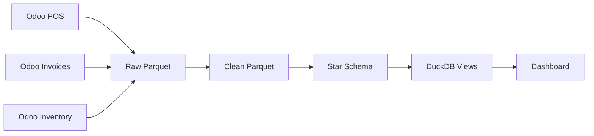

# NKDash - New Khatulistiwa Analytics Dashboard

A comprehensive analytics dashboard for New Khatulistiwa, providing real-time insights into sales, inventory, and business performance through modern data visualization and ETL pipelines.

## 🚀 Quick Start

### Prerequisites
- Docker & Docker Compose
- Git
- Odoo ERP access credentials

### Installation
```bash
# Clone the repository
git clone <repository-url>
cd nkdash

# Configure environment variables
cp .env.example .env
# Edit .env with your Odoo credentials

# Start all services
docker-compose up --build -d

# Access the dashboard
open http://localhost:8050
```

## 📊 Features

### Dashboard Capabilities
- **Sales Analytics**: Real-time revenue, trends, and performance metrics
- **Inventory Management**: Stock levels, sell-through analysis, ABC classification
- **Profit Analysis**: Gross profit calculations with tax-adjusted costs
- **Operational Tools**: ETL management, data refresh, system monitoring

### Technical Features
- **Modern Stack**: Plotly Dash + DuckDB + Celery + Redis
- **Data Lake**: Multi-layer parquet storage (raw → clean → star-schema)
- **Performance**: Cached queries, progressive loading, sub-second response times
- **Reliability**: Automated error handling, retry mechanisms, health monitoring

## 📚 Documentation

### Core Documentation
- **[Project SSOT](SSOT.md)** - Project coordination and milestones
- **[ETL Guide](ETL_GUIDE.md)** - Technical ETL documentation
- **[Troubleshooting](TROUBLESHOOTING.md)** - Common issues and solutions
- **[Glossary](docs/glossary.md)** - Terms and definitions

### Architecture & Design
- **[Architecture](docs/ARCHITECTURE.md)** - System architecture overview
- **[Performance Policy](docs/performance_policy.md)** - Optimization guidelines
- **[Inventory Spec](docs/inventory_spec.md)** - Inventory dashboard specification

### Operational Guides
- **[Runbook](docs/runbook.md)** - Operational procedures
- **[Decision Log](docs/decisions.md)** - Project decisions and history

## 🏗️ Architecture

### System Overview
```mermaid
Odoo ERP → ETL Pipeline → Data Lake → DuckDB → Dash Dashboard
```

### Components
- **ETL Pipeline**: Celery-based distributed data processing
- **Data Lake**: Parquet files with partitioned storage
- **Analytics Engine**: DuckDB for fast analytical queries
- **Frontend**: Plotly Dash with Mantine Components
- **Infrastructure**: Docker containers with Redis caching

### Data Flow


## 🔧 Configuration

### Environment Variables
```ini
# Odoo Connection
ODOO_HOST=your-odoo-instance.odoo.com
ODOO_DB=your_database
ODOO_USERNAME=your_email@example.com
ODOO_API_KEY=your_api_key
ODOO_PROTOCOL=jsonrpc+ssl

# Data Lake
DATA_LAKE_ROOT=/data-lake

# Redis & Caching
REDIS_URL=redis://redis:6379/0
DASH_CACHE_TTL_SECONDS=600
```

### Docker Setup
```bash
# Start all services
docker-compose up --build -d

# View logs
docker-compose logs -f dash-app

# Access dashboard
open http://localhost:8050
```

## 📈 Data Sources

### Odoo Integration
- **POS Sales**: `pos.order` with lines and payments
- **Invoice Sales**: `account.move` (customer invoices)
- **Purchases**: `account.move` (vendor bills)
- **Inventory**: `stock.move.line` (stock movements)
- **Products**: `product.product` with categories and brands

### Data Processing
- **Extraction**: Daily automated pulls from Odoo
- **Transformation**: Data cleaning, validation, normalization
- **Loading**: Star schema with fact and dimension tables
- **Analytics**: DuckDB views for dashboard queries

## 🎯 Key Metrics

### Sales KPIs
- **Revenue**: Total sales with tax adjustments
- **Orders**: Transaction count and average order value
- **Products**: Top performing items and category analysis
- **Customers**: Sales trends and customer segments

### Inventory KPIs
- **Stock Levels**: Current on-hand quantities
- **Sell-through**: Inventory efficiency ratios
- **ABC Analysis**: Product classification by revenue
- **Days of Cover**: Inventory runway calculations

### Profit KPIs
- **Gross Profit**: Revenue minus cost of goods sold
- **Margins**: Profit percentages by product/category
- **Cost Analysis**: Tax-adjusted cost calculations
- **Trend Analysis**: Profit over time comparisons

## 🛠️ Development

### Project Structure
```bash
nkdash/
├── app.py                    # Main Dash application
├── etl_tasks.py              # ETL task definitions
├── pages/                    # Dashboard pages
├── services/                 # Business logic services
├── etl/                      # ETL implementation modules
├── scripts/                  # Utility scripts
├── docs/                     # Documentation
├── data-lake/                # Parquet data storage
├── docker-compose.yml        # Container orchestration
└── requirements.txt          # Python dependencies
```

### Adding New Features
1. **Data Sources**: Add extractors in `etl/extract/`
2. **Transformations**: Add cleaners in `etl/transform/`
3. **Dashboard Pages**: Create pages in `pages/`
4. **Metrics**: Add services in `services/`

## 🔍 Monitoring & Maintenance

### Health Checks
```bash
# System status
docker-compose ps

# ETL status
docker-compose exec celery-worker celery -A etl_tasks inspect active

# Data freshness
docker-compose exec dash-app python -c "
from services.duckdb_connector import get_duckdb_connection
conn = get_duckdb_connection()
result = conn.execute('SELECT MAX(date) FROM fact_sales').fetchone()
print(f'Latest data: {result[0]}')
"
```

### Common Issues
- **Dashboard not loading**: Check DuckDB connection and restart services
- **ETL failures**: Verify Odoo credentials and network connectivity
- **Performance issues**: Enable caching and check query optimization
- **Data gaps**: Run manual ETL for missing dates

For detailed troubleshooting, see [TROUBLESHOOTING.md](TROUBLESHOOTING.md).

## 📊 Project Status

### Current Version
- **Version**: 3.0 (post-refactor)
- **Status**: Production ready
- **Last Updated**: 2026-02-21

### Recent Improvements
- **Documentation**: Restructured into modular guides
- **Performance**: Added caching and query optimization
- **Reliability**: Enhanced error handling and recovery
- **Usability**: Improved navigation and search

## 📞 Support

### Resources
- **Project SSOT**: [SSOT.md](SSOT.md)
- **Technical Documentation**: [ETL_GUIDE.md](ETL_GUIDE.md)
- **Operational Procedures**: [docs/runbook.md](docs/runbook.md)
- **Change History**: [docs/ssot_changelog.md](docs/ssot_changelog.md)

---

*Built with ❤️ for New Khatulistiwa's data-driven decision making*
